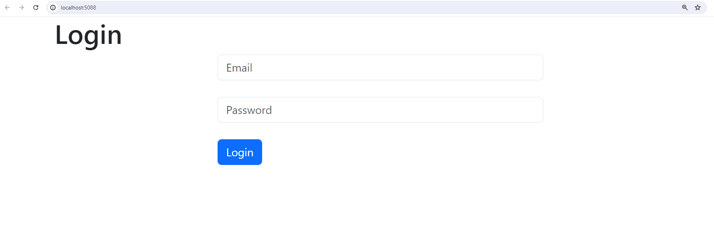
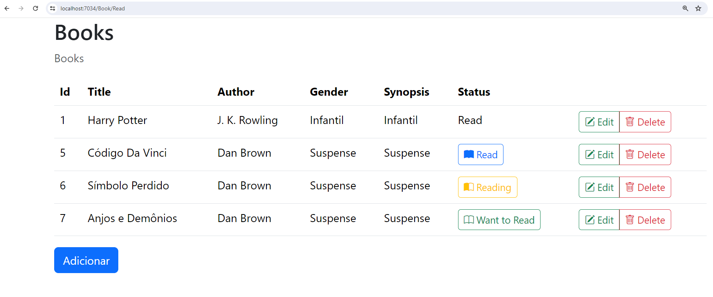
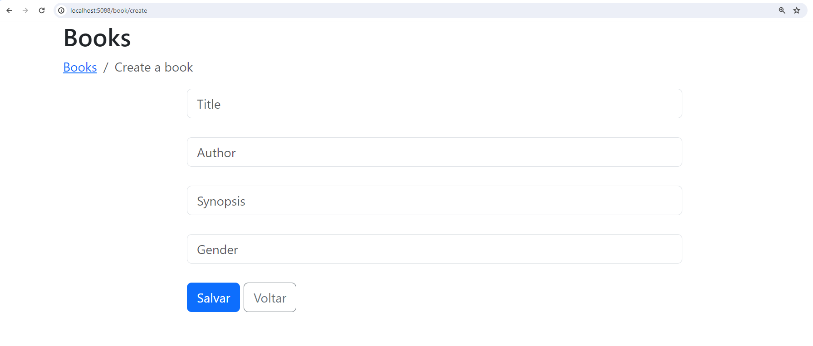
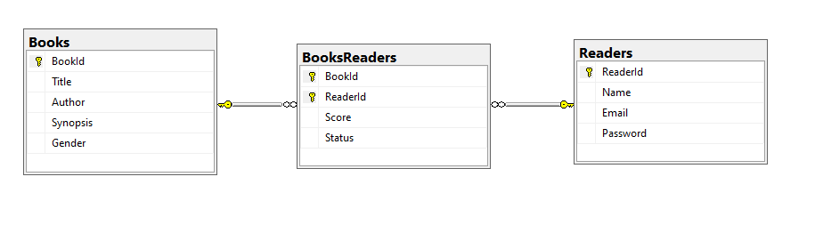

# BooksWeb

## Telas

## Diagrama do Banco de Dados

## Referências:

Bootstrap Icon

https://icons.getbootstrap.com/

Entity Framework

https://learn.microsoft.com/pt-br/ef/core/get-started/overview/first-app?tabs=netcore-cli

Configurar Entity Framework

https://learn.microsoft.com/en-us/ef/core/dbcontext-configuration/

Instalar o EF no computador:

`dotnet tool install --global dotnet-ef`

Para manipular dados em memória:

`dotnet add package Microsoft.EntityFrameworkCore.InMemory`

Para manipular banco de dados (Sqlite, SqlServer, Oracle, MySQL, Postgres etc.)
SQLite:

`dotnet add package Microsoft.EntityFrameworkCore.Sqlite`

SQL Server:

`dotnet add package Microsoft.EntityFrameworkCore.SqlServer`

E para realizar model first:

`dotnet add package Microsoft.EntityFrameworkCore.Design`

`dotnet ef migrations add InitialCreate`

Remove a última migração:

`dotnet ef migrations remove`

Visualizar o script gerado na migração:

`dotnet ef migrations script >> script.sql`

Atualiza o banco de dados com a migration:

`dotnet ef database update`

`dotnet ef database update --connection "Data Source=My.db"`

